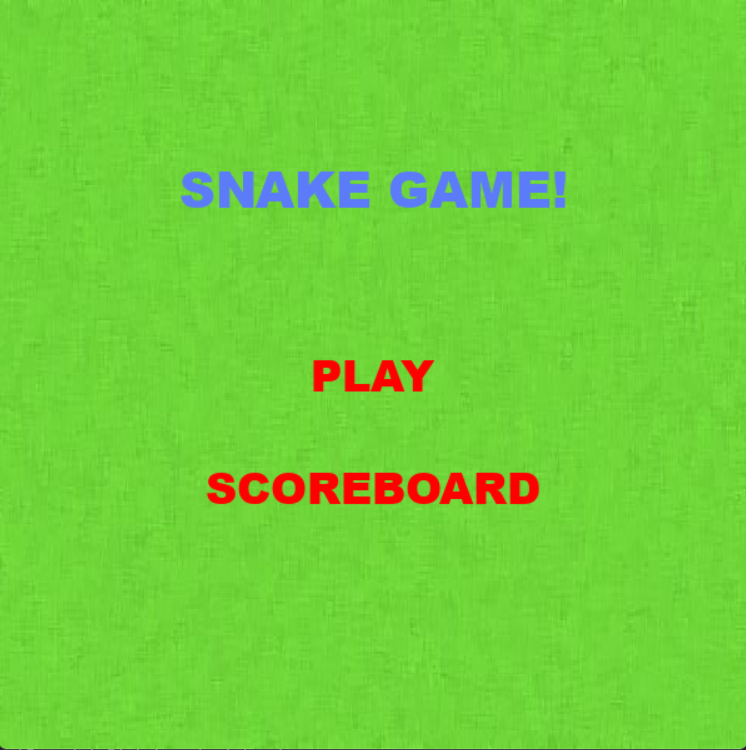
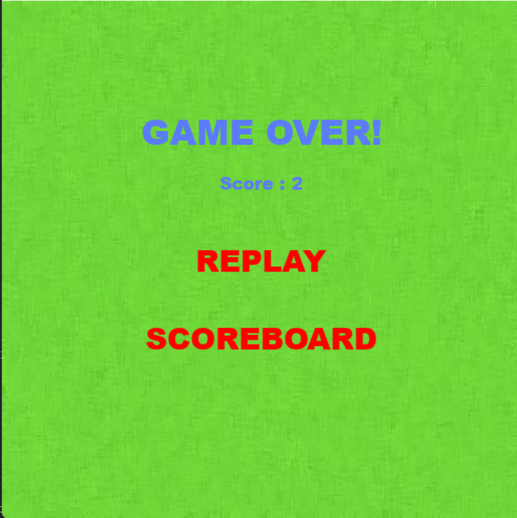
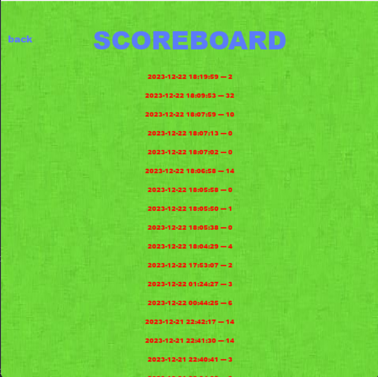
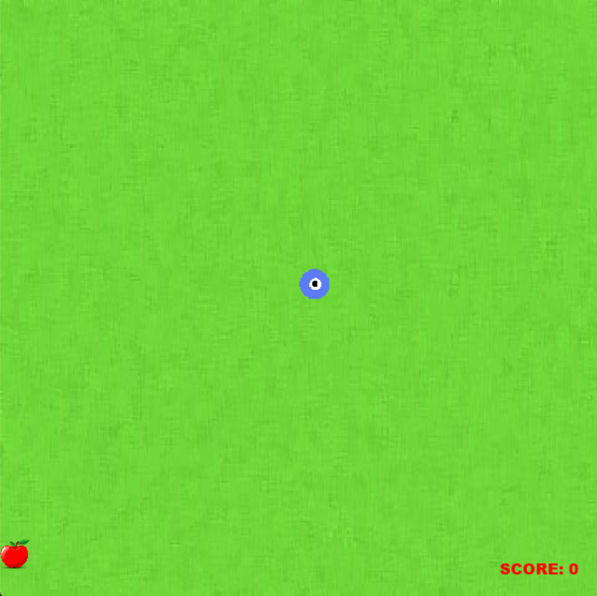
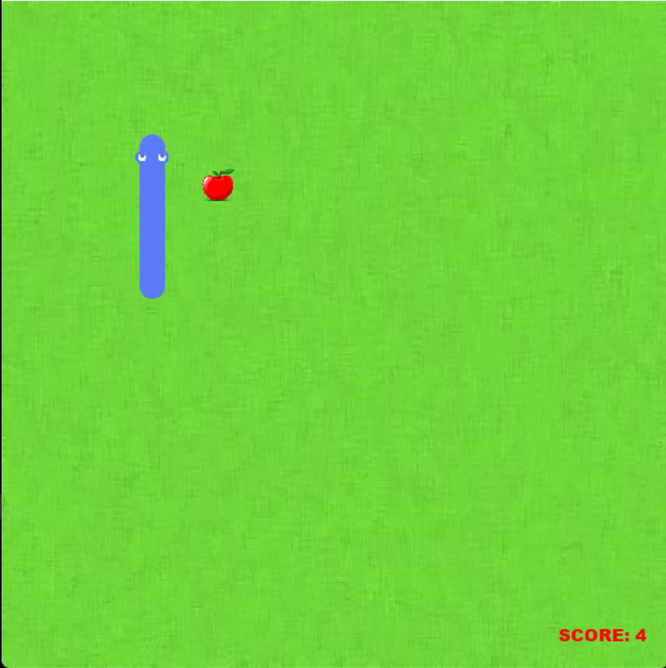

# snake

Je vous présente ce snake game réalisé en python en utilisant pygame.

Le jeu possède un menu principal dans lequel nous pouvons, soit jouer soit consulter le tableau des points des précédentes parties.

Une fois la partie lancée nous pouvons controler notre petit serpent de 1 grâce aux fleches directionnelles, pour chaque pomme mangée le serpent grandira de un.
Le but du jeu est de manger le plus de pommes possibles sans toucher ni les murs ni son propre corps.

A la fin de notre partie nous pouvons soit rejouer soit consulter le scoreboard

## Screenshots

### Ce qu'il reste à faire

Corriger le bug de mouvement
scrollbar scoreboard ou trier par points ou ajouter des boutons pour faire office de scroll
score pendant la partie
